# Hugh Greethead - Portfolio Website
Portfolio website: https://hughgreethead.dev

Github repository: https://github.com/HughG-50/HughG-50

## Purpose

The purpose of this website is to outline my skills and interests and provide a place to showcase the programming projects that I am most proud of. This will increase my ability to be noticed within the industry and find likeminded developers who may wish to collaborate.

The website also serves the purpose of demonstrating design and front-end development skills.

## Functionality and Features

### Navigation Bar
The site includes a navigation bar on all of the pages that allows the user to easily navigate between all of the different pages of the website: Home, About, Projects and Blog.

The navigation bar is in the same spot at the top of each page so the user can navigate the website with ease and familiarity. Each link has a hover effect to highlight the text help the user understand that the item is a clickable link.

### Professional Social Media Links
The homepage includes three links to my personal social media accounts that are relevant to my development work: Twitter, Github and Linkedin. 

Box shading, a slight color difference make the elements stand out and make it obvious that they are clickable links with a button type appearance. Hover and active effects to scale the image and make it appear to 'click in' like a button, further enhance the experience.

### About Page - Resume Download Link and Skills

The about page provides a little more overview about me and context to my skills and interest. Visitors to the page are able to download a copy of my resume by clicking on the resume button, which opens a pdf of my resume in a new tab.

In the Skills section I have outlined the various skills, technologies and my education background that someone may find useful. Each skill has a hover effect that changes the background colour to highlight the technology and make the page appear more engaging.

### Projects Page

This page is designed to layout in a visually appealing way a project that I have completed that demonstrates my skills in various disciplines and technologies.

Each Project has a title, related image which also links to the project and a brief description outlining what the project was about. 

Flexbox styling has been used to layout the projects in a grid type of layout that is also
responsive as the screen is changed in size.

### Blog Page

The Blog page makes use of a [vue.js script written by Chris John](https://medium.com/retainable/how-to-embed-medium-on-your-website-the-easy-way-41ac0a13231e), that allows the RSS feeds from a Medium profile or publication page to be embedded into a website. I have chosen to display blogs from my [Medium publication](https://medium.com/hugh-greethead) in a carousel format. I have also edited the styling to be consistent with the rest of the webpage - e.g. border-radius to round the appearance of elements and box-shading. 

When the user clicks on the link the page displays the embedded blog. In future I'd like to remove this as I prefer the consistent formatting of viewing on Medium directly, as well as increasing my Medium page's visibility, while keeping the appealing visual format of the carousel previews.

### Three versions

There are multiple versions of this website saved on Github in different branches.
* 'master' branch with the base version that is currently deployed
* 'alt-font' branch which changes the base font from 'Roboto' to 'Merriweather'
* 'alt-color' branch which changes the main background-color to an alternate shade

### Subresource integrity (SRI)

SRI ensures that the files linking to your website html document have not changed unexpectedly. It creates a sha512 hash to which is used as the integrity attribute of link tags. If the hash doesn't match, then changes have been made to the external files, e.g. CSS and it will prevent those from loading.

## Sitemap

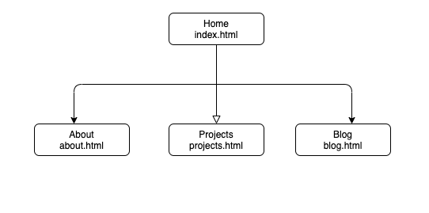

## Screenshots

### Homepage

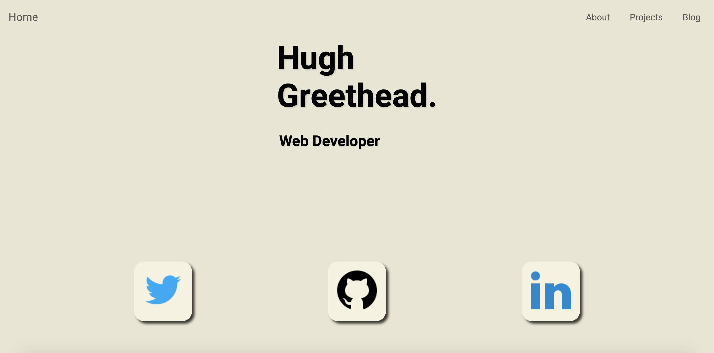

### About 

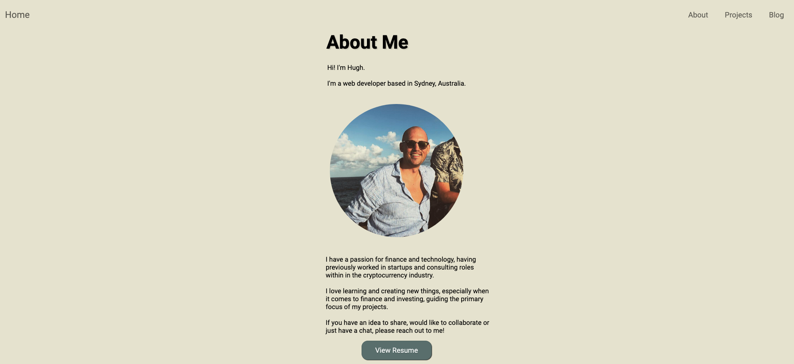

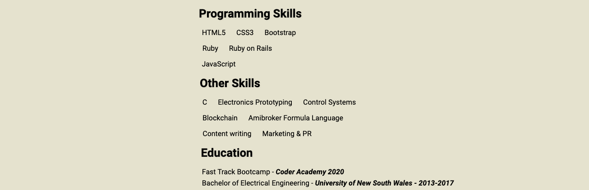

### Projects 

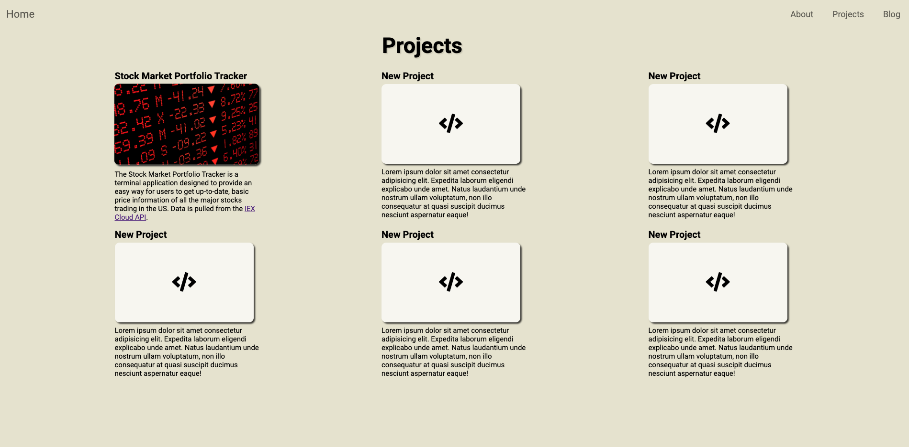

### Blog 

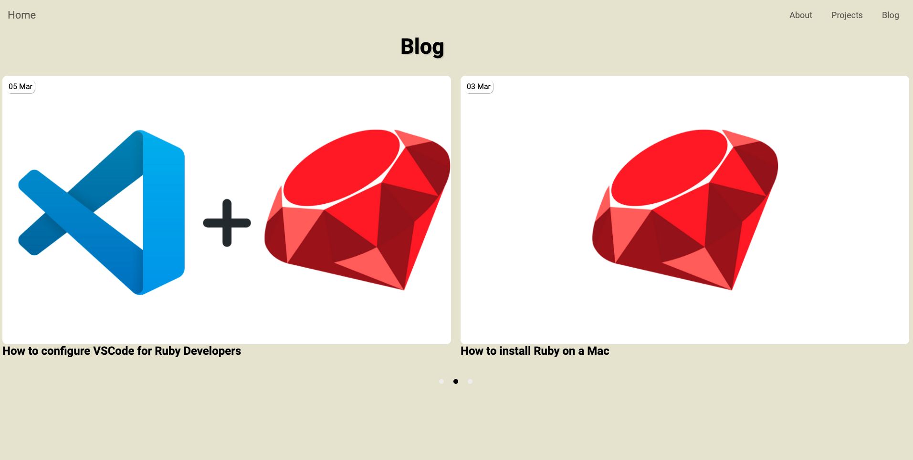

## Target Audience

The target audience is three different groups of people:

1. Employers
2. Project leads/other developers looking for collaborators
3. General friends/family - a tool to showcase and give them a better understanding of what I do.

## Tech stack

* HTML - all content of webpage structured within
* CSS - all styling and positioning of elements
* Vue.js - used to embed Medium RSS into page
* Github Pages - used for web-hosting

## Wireframes

### Homepage

**Desktop**
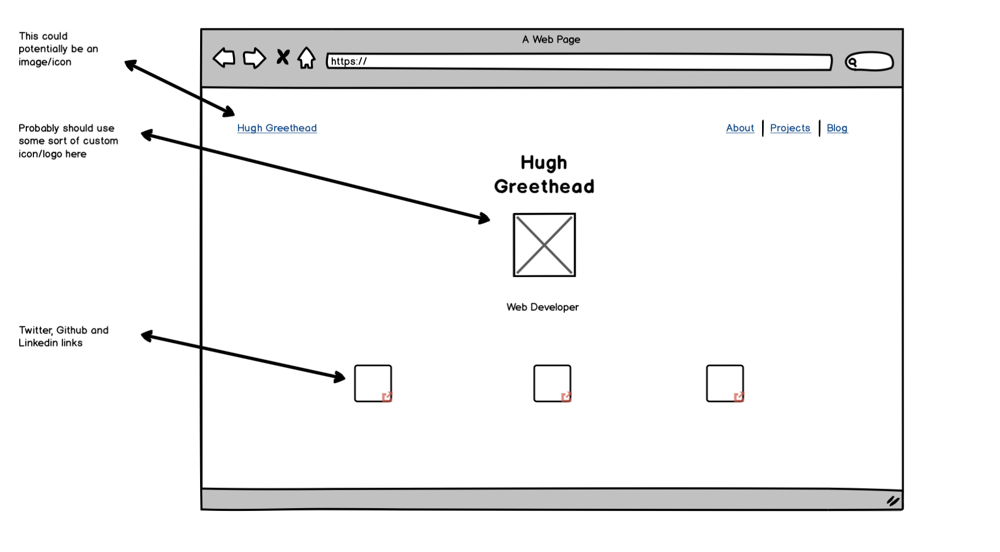

**Mobile**
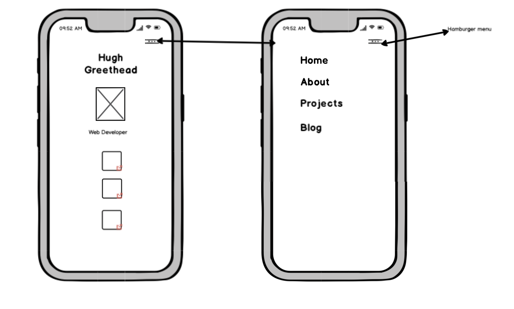

### About 

**Desktop**
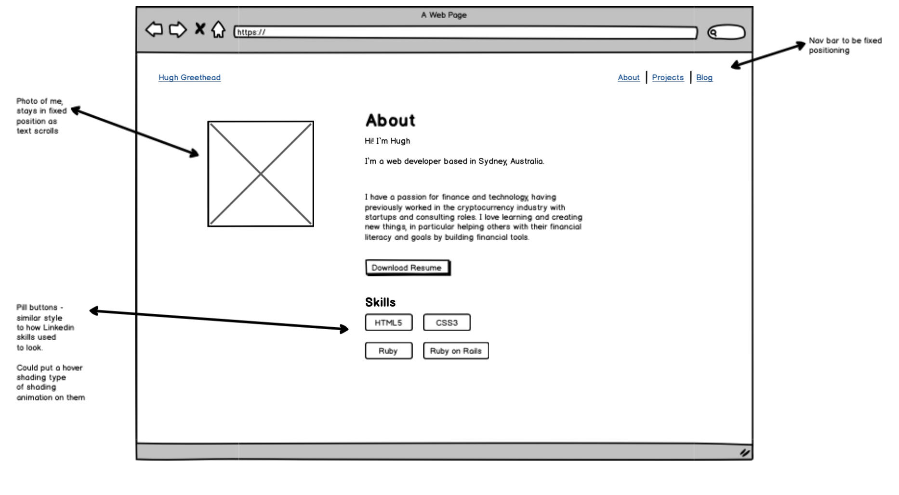

**Mobile**
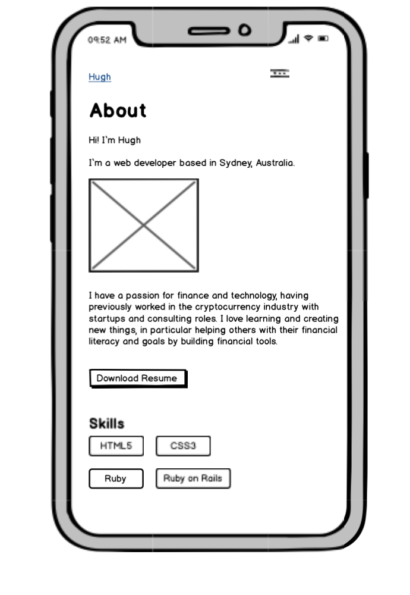

### Projects 

**Desktop**
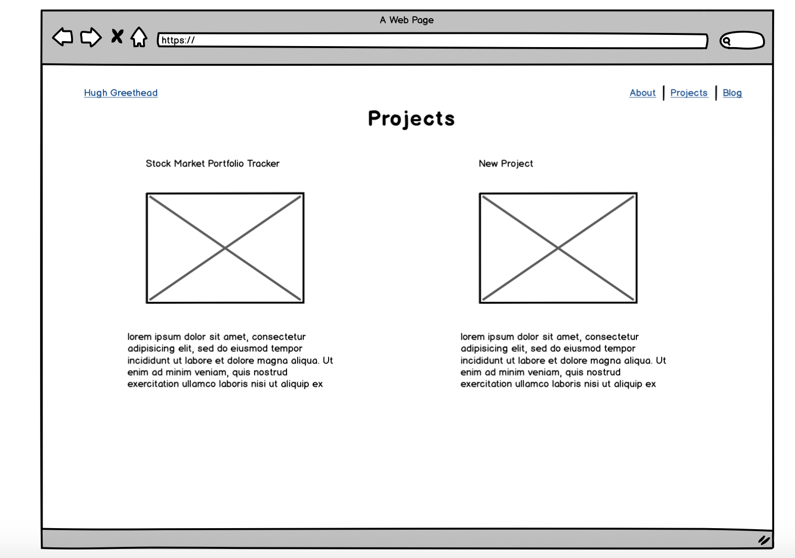

**Mobile**
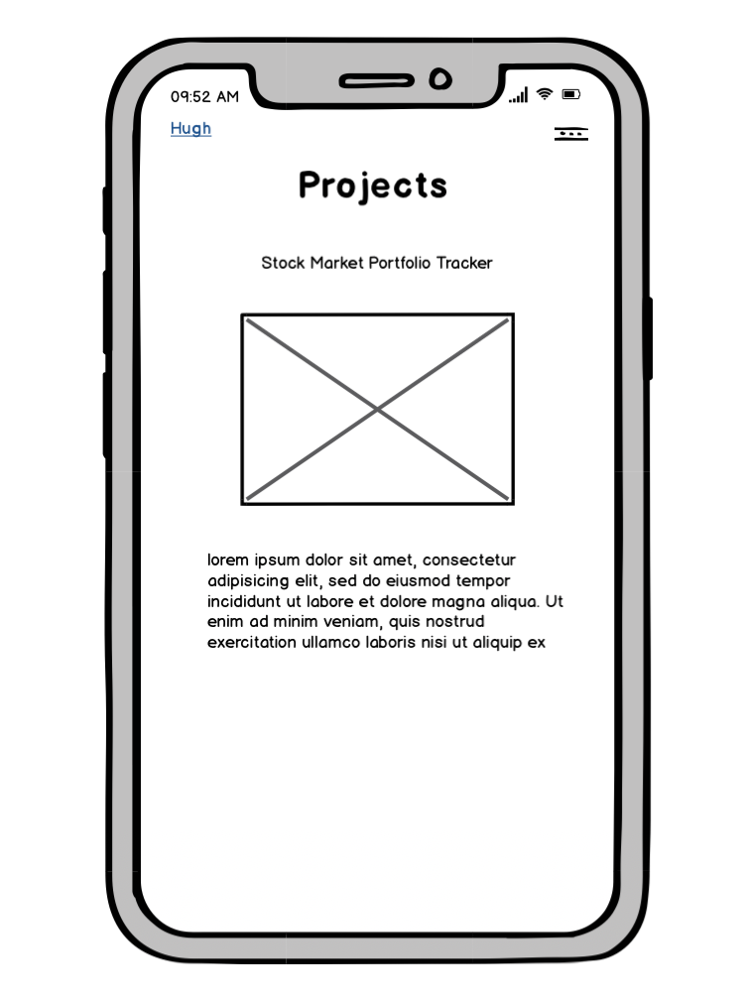

### Blog 

**Desktop**
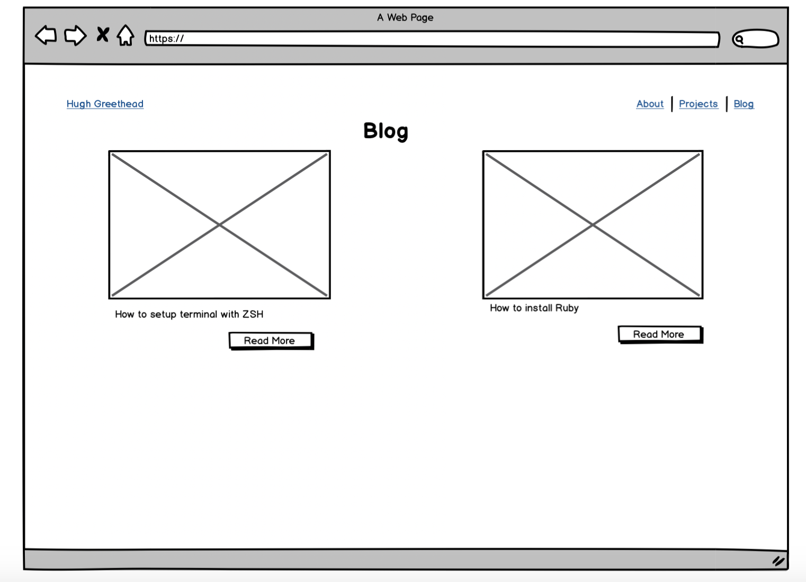

**Mobile**
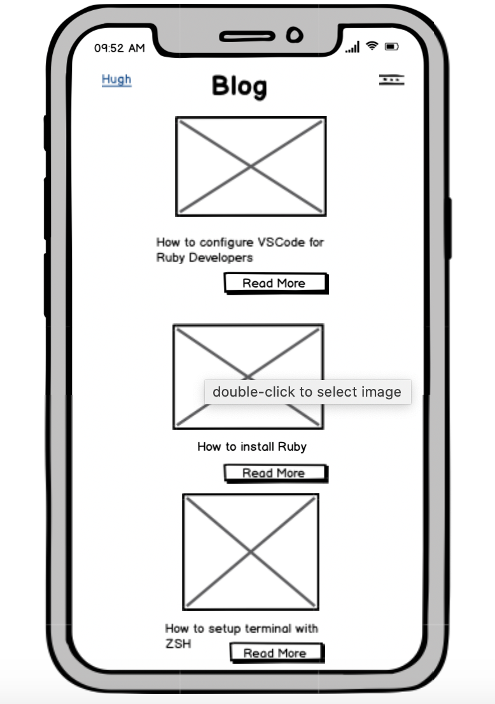

